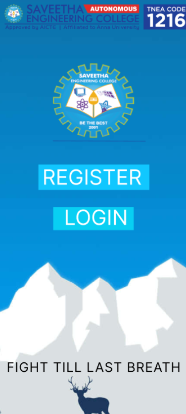
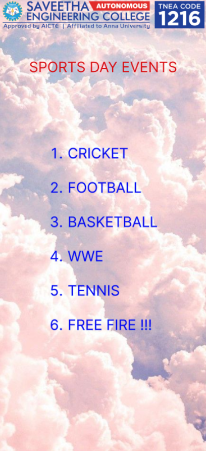
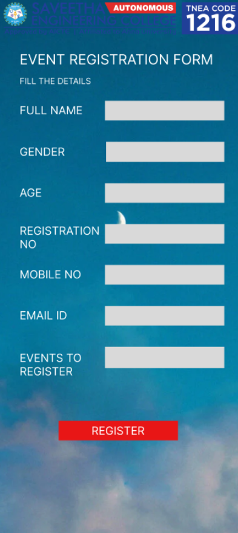
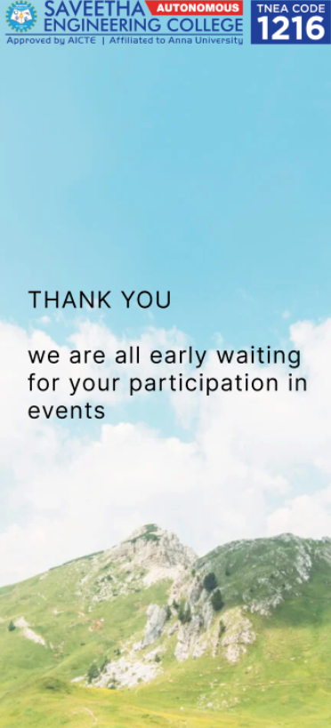

# Ex09 Event Registration Web Application
## Date: 27.05.2025

## AIM:
To design, develop and deploy a web application for event registration.

## DESIGN STEPS:

### Step 1:
Create a new frame.

### Step 2:
Select any one preset size of your choice.

### Step 3:
Select the shapes you need.

### Step 4:
Import images as needed.

### Step 5:
Create pages based on your need and link them.

### Step 6:

Validate the HTML and CSS code.

### Step 6:

Publish the website in the given URL.

## DESIGN TOOL:
Figma

## CODE:
```
<div style="width: 440px; height: 956px; position: relative; background: white">
  
  
  <div style="width: 255px; height: 58px; left: 92px; top: 381px; position: absolute; background: #11C7FF"></div>
  <div style="width: 235px; left: 101px; top: 381px; position: absolute; color: white; font-size: 48px; font-family: Inter; font-weight: 400; word-wrap: break-word">REGISTER</div>
  <div style="width: 185px; height: 53px; left: 126px; top: 478px; position: absolute; background: #08CFF3"></div>
  <div style="width: 171px; left: 151px; top: 473px; position: absolute; color: white; font-size: 48px; font-family: Inter; font-weight: 400; word-wrap: break-word">LOGIN</div>
  <div style="width: 435px; height: 59px; left: 19px; top: 826px; position: absolute; color: black; font-size: 30px; font-family: Inter; font-weight: 400; letter-spacing: 1.50px; word-wrap: break-word">FIGHT TILL LAST BREATH</div>
</div>
<div style="width: 440px; height: 956px; position: relative; background: white">
  
  <div style="width: 314px; height: 19px; left: 63px; top: 124px; position: absolute; color: #DF0D11; font-size: 30px; font-family: Inter; font-weight: 400; word-wrap: break-word">SPORTS DAY EVENTS</div>
  
  <div style="width: 265px; height: 408px; left: 99px; top: 305px; position: absolute"><span style="color: #0909F0; font-size: 30px; font-family: Inter; font-weight: 400; word-wrap: break-word">CRICKET<br/></span><span style="color: #0909F0; font-size: 30px; font-family: Inter; font-weight: 400; word-wrap: break-word"><br/></span><span style="color: #0909F0; font-size: 30px; font-family: Inter; font-weight: 400; word-wrap: break-word">FOOTBALL<br/></span><span style="color: #0909F0; font-size: 30px; font-family: Inter; font-weight: 400; word-wrap: break-word"><br/></span><span style="color: #0909F0; font-size: 30px; font-family: Inter; font-weight: 400; word-wrap: break-word">BASKETBALL  <br/>WWE<br/></span><span style="color: #0909F0; font-size: 30px; font-family: Inter; font-weight: 400; word-wrap: break-word"><br/></span><span style="color: #0909F0; font-size: 30px; font-family: Inter; font-weight: 400; word-wrap: break-word">TENNIS  <br/>FREE FIRE !!!</span></div>
</div>
<div style="width: 440px; height: 956px; position: relative; background: white">
  
  <div style="width: 314px; height: 19px; left: 63px; top: 124px; position: absolute; color: #DF0D11; font-size: 30px; font-family: Inter; font-weight: 400; word-wrap: break-word">SPORTS DAY EVENTS</div>
  
  <div style="width: 265px; height: 408px; left: 99px; top: 305px; position: absolute"><span style="color: #0909F0; font-size: 30px; font-family: Inter; font-weight: 400; word-wrap: break-word">CRICKET<br/></span><span style="color: #0909F0; font-size: 30px; font-family: Inter; font-weight: 400; word-wrap: break-word"><br/></span><span style="color: #0909F0; font-size: 30px; font-family: Inter; font-weight: 400; word-wrap: break-word">FOOTBALL<br/></span><span style="color: #0909F0; font-size: 30px; font-family: Inter; font-weight: 400; word-wrap: break-word"><br/></span><span style="color: #0909F0; font-size: 30px; font-family: Inter; font-weight: 400; word-wrap: break-word">BASKETBALL  <br/>WWE<br/></span><span style="color: #0909F0; font-size: 30px; font-family: Inter; font-weight: 400; word-wrap: break-word"><br/></span><span style="color: #0909F0; font-size: 30px; font-family: Inter; font-weight: 400; word-wrap: break-word">TENNIS  <br/>FREE FIRE !!!</span></div>
</div>
<div style="width: 440px; height: 956px; position: relative; background: white">
  
  
  <div style="width: 393px; height: 204px; left: 36px; top: 376px; position: absolute; color: black; font-size: 30px; font-family: Inter; font-weight: 400; letter-spacing: 1.50px; word-wrap: break-word">THANK YOU <br/><br/>we are all early waiting for your participation in events </div>
</div>
```

## OUTPUT:









## RESULT:
The program to design, develop and deploy a web application for event registration is completed successfully.
